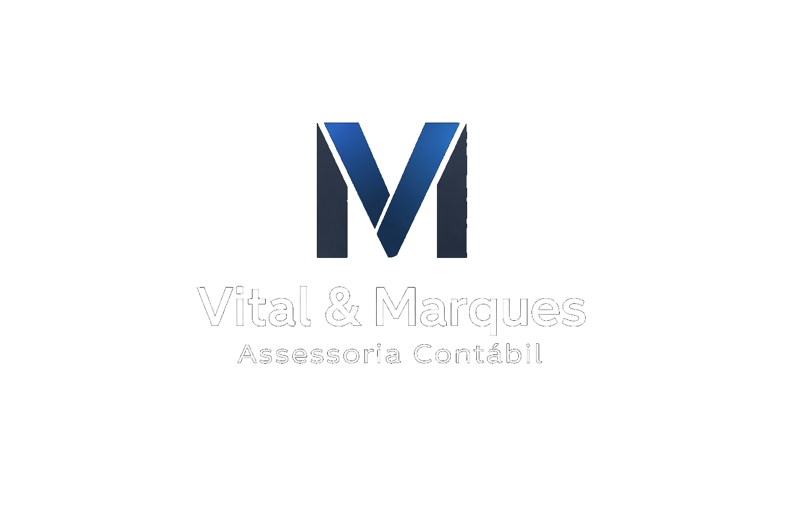

# Vital & Marques - Site Institucional

Site institucional da Vital & Marques Assessoria Contabil, com foco em autoridade de marca, clareza comercial e conversao de visitantes em contatos qualificados.



## Visao Geral
Este projeto foi desenvolvido como um website estatico profissional para apresentar:

1. Posicionamento da empresa.
2. Portifolio de servicos contabeis.
3. Estrutura de planos de atendimento.
4. Canais de contato e localizacao.
5. Acesso rapido ao login do portal Onvio.

## Galeria Visual
As imagens abaixo representam a identidade visual utilizada nas principais secoes do site.


## Arquitetura do Projeto
```text
vitalemarques-site/
	assets/
		css/
			style.css
		js/
			script.js
		img/
			logo-preta.png
			favicon-logo.png
			hero-bg-city.jpg
			bg-sobre.jpg
			bg-servicos.jpg
			bg-planos.jpg
			bg-contato.jpg
	pages/
		sobre.html
		servicos.html
		planos.html
		contato.html
	index.html
	privacidade.html
	robots.txt
	.htaccess
	README.md
```

## Mapa de Paginas
| Pagina | Objetivo |
|---|---|
| `index.html` | Apresentacao institucional, diferenciais, planos e CTA principal |
| `pages/servicos.html` | Detalhamento dos servicos e beneficios operacionais |
| `pages/planos.html` | Estrutura comercial dos planos e comparacao de escopos |
| `pages/sobre.html` | Posicionamento, metodo de trabalho e credibilidade |
| `pages/contato.html` | Contato, mapa, endereco e canais de atendimento |
| `privacidade.html` | Politica de privacidade e diretrizes LGPD |

## Stack Tecnologica
1. HTML5 sem framework.
2. CSS3 com design system baseado em variaveis.
3. JavaScript vanilla com padroes modernos de performance.
4. Font Awesome para iconografia.
5. Google Fonts (Manrope).

## Recursos de UX/UI Implementados
1. Header fixo com estado dinâmico em scroll.
2. Menu mobile com controle de foco e fechamento por tecla ESC.
3. Revelacao progressiva de secoes via IntersectionObserver.
4. Scroll progress bar no topo.
5. Microinteracoes em botoes e cards (magnetic/tilt).
6. CTA integrados ao WhatsApp com mensagem contextual.
7. Mapa e bloco de atendimento presencial na pagina de contato.

## Seguranca e Confiabilidade
O projeto recebeu uma camada de seguranca para ambiente estatico:

1. Content Security Policy (CSP) nas paginas.
2. Referrer policy e hardening basico no HTML.
3. Arquivo `.htaccess` com headers de seguranca e cache.
4. `robots.txt` para controle de rastreadores.
5. Validacoes no JavaScript para links de WhatsApp.

## SEO e Performance
1. Titles e descriptions por pagina.
2. Estrutura semantica para melhor indexacao.
3. Imagens comprimidas e fundo otimizado por secao.
4. Cache de recursos estaticos via `.htaccess`.
5. Carregamento leve por nao usar frameworks pesados.

## Portais (Cliente e Funcionario)
No estado atual, ambos os botoes direcionam para o login estavel:

`https://onvio.com.br/login/`

Observacao: quando a empresa tiver URLs dedicadas por perfil, basta substituir os `href` dos botoes nos headers e menus mobile.

## Como Executar Localmente
Como o projeto e estatico, ha duas formas simples:

1. Abrir `index.html` direto no navegador.
2. Rodar um servidor local (recomendado):

```bash
# Python 3
python -m http.server 5500

# Acesse
http://localhost:5500
```

## Publicacao
Pode ser publicado em qualquer hosting estatico, por exemplo:

1. GitHub Pages
2. Netlify
3. Vercel (modo static)
4. Hostinger / cPanel (Apache)

Para Apache, manter `.htaccess` na raiz do projeto.

## Checklist de Qualidade
1. Responsividade validada em desktop e mobile.
2. Links principais e CTAs revisados.
3. Favicon configurado com identidade da marca.
4. Politica de privacidade disponivel.
5. Estrutura pronta para receber links finais dos portais dedicados.

## Roadmap Sugerido
1. Adicionar links dedicados de portal (cliente e funcionario).
2. Publicar sitemap.xml.
3. Conectar analytics com consentimento de cookies.
4. Inserir capturas reais do site no README (desktop e mobile).

## Autor e Contexto
Projeto institucional desenvolvido para Vital & Marques Assessoria Contabil, com foco em comunicacao estrategica, presenca digital e experiencia profissional.